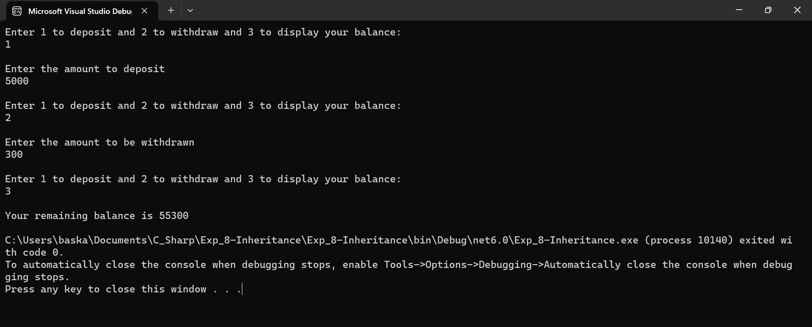

# INTERFACE
## AIM:
To Develop a small bank application by declaring deposit() and withdrawal() as abstract methods in the interface. Get the choice from the user whether to perform withdrawal or deposit operation. After the operation completes, display the balance amount.

## ALGORITHM:
### STEP 1:
Create an interface.

### STEP 2:
Create a child class.

### STEP 3:
Declare 2 functions deposit() and withdrawal() as abstract methods in the interface.

### STEP 4:
Create those 2 functions in the child class and perform respective operation.

### STEP 5:
Use while loop and and switch case to Get the choice from the user whether to perform withdrawal or deposit operation.

### STEP 6:
After performing the functions display the remaining balance of the use.

## PROGRAM:
```
NAME : PAARKAVY B
REG NO : 212221230072
```

```
using System;
namespace ex09
{
    public interface bank
    {
        void deposit(int amt);
        void withdraw(int amt);
    }
    public class accnt : bank
    {
        public int balance = 50600, amt;
        int a = 1;
        public accnt()
        {

            while (a == 1)
            {
                Console.WriteLine("Enter 1 to deposit and 2 to withdraw and 3 to display your balance:");
                int choice = Convert.ToInt32(Console.ReadLine());
                Console.WriteLine();
                switch (choice)
                {
                    case 1:
                        Console.WriteLine("Enter the amount to deposit");
                        amt = Convert.ToInt32(Console.ReadLine());
                        Console.WriteLine();
                        deposit(amt);
                        break;

                    case 2:
                        Console.WriteLine("Enter the amount to be withdrawn");
                        amt = Convert.ToInt32(Console.ReadLine());
                        Console.WriteLine();
                        withdraw(amt);
                        break;

                    case 3:
                        display();
                        break;
                }
            }
            Console.ReadKey();

        }
        public void deposit(int amt)
        {
            balance += amt;
        }
        public void withdraw(int amt)
        {
            balance -= amt;
        }
        public void display()
        {
            Console.WriteLine("Your remaining balance is " + balance);
            a = 0;
        }
    }
    class Program
    {
        static void Main(string[] args)
        {
            accnt p1 = new accnt();
        }
    }
}
```

## OUTPUT:


## RESULT:
Thus, C# program to develop a bank application using interface is implemented successfully.